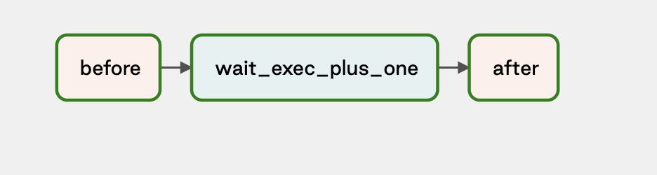
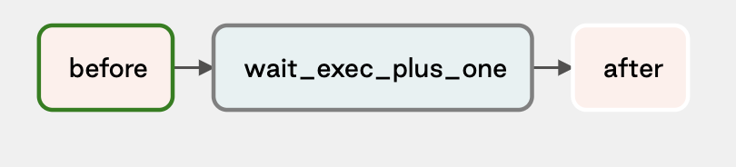
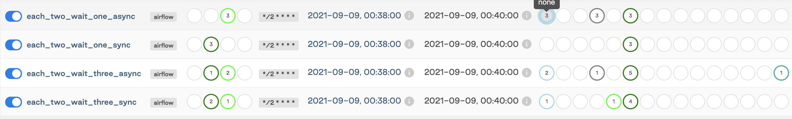
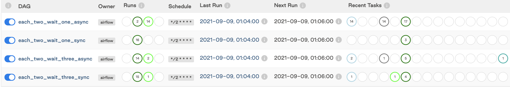

Thie repo contains four DAGs, all of which are scheduled to run every two minutes.


| Dag Name | Uses Sensor | Sensor waits `execution_date` ... | waits until ... the `start_date` | gets stuck |
|:--|:--|:--|:--|:--|
|each_two_wait_one_async    | DateTimeSensorAsync | `+1m` | before| yes |
|each_two_wait_one_sync     | DateTimeSensor      | `+1m` | before | no |
|each_two_wait_three_async  | DateTimeSensorAsync | `+3m` | after | no |
|each_two_wait_three_sync   | DateTimeSensor      | `+3m` | after | no |

They all have a sensor as their middle task:


Most of them work as expected, but "each_two_wait_one_async" gets stuck.  When this happens, the triggerer sets the trigger and fires immediately (which is appropriate, because `start_date` > `execution_date +2m`), but "after" task never runs.

The DAG ends up stuck in a state where the middle task is queued.



Here is a screenshot after 4 minutes:


And one after 30 minutes:


Note that this was run in a deployment where [the Triggerer's liveness probe was failing](https://astronomer.slack.com/archives/CGQSYG25V/p1631144952249900?thread_ts=1631128811.237300&cid=CGQSYG25V), so after ten minutes, kubernetes started restarting the triggerer.  In the case where the trigger had to wait before firing, it was fault tolerant enough to keep up with the non-`Async` equivalent.  In the case where its target date was in the past--and it had to fire immediately--the failures started piling up before the first restart.

I from a blank slate four times, and it only got stuck thrice.  When I let it run for half an hour, 12 of 14 runs got stuck.  I'm not sure what the condition is that makes it succeed, but it seems to occur less than 50% of the time.

Here are some scheduler logs for a time when it got stuck:

```
Waiting for host: airflow-postgresql.iter-52908.svc.cluster.local. 5432
/usr/local/lib/python3.9/site-packages/airflow/configuration.py:357 DeprecationWarning: The default_queue option in [celery] has been moved to the default_queue option in [operators] - the old setting has been used, but please update your config.
/usr/local/lib/python3.9/site-packages/airflow/configuration.py:357 DeprecationWarning: The default_queue option in [celery] has been moved to the default_queue option in [operators] - the old setting has been used, but please update your config.
  ____________       _____________
 ____    |__( )_________  __/__  /________      __
____  /| |_  /__  ___/_  /_ __  /_  __ \_ | /| / /
___  ___ |  / _  /   _  __/ _  / / /_/ /_ |/ |/ /
 _/_/  |_/_/  /_/    /_/    /_/  \____/____/|__/
[2021-09-09 02:02:33,666] {scheduler_job.py:536} INFO - Starting the scheduler
[2021-09-09 02:02:33,666] {scheduler_job.py:541} INFO - Processing each file at most -1 times
[2021-09-09 02:02:33,701] {kubernetes_executor.py:492} INFO - Start Kubernetes executor
[2021-09-09 02:02:33,722] {kubernetes_executor.py:128} INFO - Event: and now my watch begins starting at resource_version: 0
[2021-09-09 02:02:33,730] {kubernetes_executor.py:456} INFO - When executor started up, found 0 queued task instances
[2021-09-09 02:02:33,733] {manager.py:162} INFO - Launched DagFileProcessorManager with pid: 27
[2021-09-09 02:02:33,739] {settings.py:51} INFO - Configured default timezone Timezone('UTC')
[2021-09-09 02:02:33,741] {settings.py:434} INFO - Loaded airflow_local_settings from /usr/local/airflow/config/airflow_local_settings.py .
[2021-09-09 02:02:33,747] {scheduler_job.py:1036} INFO - Resetting orphaned tasks for active dag runs
[2021-09-09 02:02:41,368] {update_checks.py:126} INFO - Checking for new version of Astronomer Certified Airflow, previous check was performed at None
[2021-09-09 02:02:41,593] {update_checks.py:82} INFO - Check finished, next check in 86400.0 seconds
[2021-09-09 02:04:16,770] {dag.py:2709} INFO - Setting next_dagrun for each_two_wait_one_async to 2021-09-09T02:04:00+00:00
[2021-09-09 02:04:16,808] {scheduler_job.py:279} INFO - 1 tasks up for execution:
	<TaskInstance: each_two_wait_one_async.before scheduled__2021-09-09T02:02:00+00:00 [scheduled]>
[2021-09-09 02:04:16,810] {scheduler_job.py:308} INFO - Figuring out tasks to run in Pool(name=default_pool) with 128 open slots and 1 task instances ready to be queued
[2021-09-09 02:04:16,810] {scheduler_job.py:336} INFO - DAG each_two_wait_one_async has 0/16 running and queued tasks
[2021-09-09 02:04:16,811] {scheduler_job.py:401} INFO - Setting the following tasks to queued state:
	<TaskInstance: each_two_wait_one_async.before scheduled__2021-09-09T02:02:00+00:00 [scheduled]>
[2021-09-09 02:04:16,813] {scheduler_job.py:433} INFO - Sending TaskInstanceKey(dag_id='each_two_wait_one_async', task_id='before', run_id='scheduled__2021-09-09T02:02:00+00:00', try_number=1) to executor with priority 3 and queue celery
[2021-09-09 02:04:16,813] {base_executor.py:82} INFO - Adding to queue: ['airflow', 'tasks', 'run', 'each_two_wait_one_async', 'before', 'scheduled__2021-09-09T02:02:00+00:00', '--local', '--subdir', 'DAGS_FOLDER/each_two_wait_one_async.py']
[2021-09-09 02:04:16,815] {kubernetes_executor.py:516} INFO - Add task TaskInstanceKey(dag_id='each_two_wait_one_async', task_id='before', run_id='scheduled__2021-09-09T02:02:00+00:00', try_number=1) with command ['airflow', 'tasks', 'run', 'each_two_wait_one_async', 'before', 'scheduled__2021-09-09T02:02:00+00:00', '--local', '--subdir', 'DAGS_FOLDER/each_two_wait_one_async.py'] with executor_config {}
[2021-09-09 02:04:16,816] {kubernetes_executor.py:296} INFO - Kubernetes job is (TaskInstanceKey(dag_id='each_two_wait_one_async', task_id='before', run_id='scheduled__2021-09-09T02:02:00+00:00', try_number=1), ['airflow', 'tasks', 'run', 'each_two_wait_one_async', 'before', 'scheduled__2021-09-09T02:02:00+00:00', '--local', '--subdir', 'DAGS_FOLDER/each_two_wait_one_async.py'], None, None)
[2021-09-09 02:04:16,856] {scheduler_job.py:487} INFO - Executor reports execution of each_two_wait_one_async.before run_id=scheduled__2021-09-09T02:02:00+00:00 exited with status queued for try_number 1
[2021-09-09 02:04:16,861] {scheduler_job.py:513} INFO - Setting external_id for <TaskInstance: each_two_wait_one_async.before scheduled__2021-09-09T02:02:00+00:00 [queued]> to 2
[2021-09-09 02:04:16,861] {kubernetes_executor.py:149} INFO - Event: eachtwowaitoneasyncbefore.194679e747c74b9ca8cf1bba2f7d89a9 had an event of type ADDED
[2021-09-09 02:04:16,861] {kubernetes_executor.py:204} INFO - Event: eachtwowaitoneasyncbefore.194679e747c74b9ca8cf1bba2f7d89a9 Pending
[2021-09-09 02:04:16,877] {kubernetes_executor.py:149} INFO - Event: eachtwowaitoneasyncbefore.194679e747c74b9ca8cf1bba2f7d89a9 had an event of type MODIFIED
[2021-09-09 02:04:16,877] {kubernetes_executor.py:204} INFO - Event: eachtwowaitoneasyncbefore.194679e747c74b9ca8cf1bba2f7d89a9 Pending
[2021-09-09 02:04:16,893] {kubernetes_executor.py:149} INFO - Event: eachtwowaitoneasyncbefore.194679e747c74b9ca8cf1bba2f7d89a9 had an event of type MODIFIED
[2021-09-09 02:04:16,893] {kubernetes_executor.py:204} INFO - Event: eachtwowaitoneasyncbefore.194679e747c74b9ca8cf1bba2f7d89a9 Pending
[2021-09-09 02:04:17,403] {kubernetes_executor.py:149} INFO - Event: eachtwowaitoneasyncbefore.194679e747c74b9ca8cf1bba2f7d89a9 had an event of type MODIFIED
[2021-09-09 02:04:17,403] {kubernetes_executor.py:204} INFO - Event: eachtwowaitoneasyncbefore.194679e747c74b9ca8cf1bba2f7d89a9 Pending
[2021-09-09 02:04:18,119] {kubernetes_executor.py:149} INFO - Event: eachtwowaitoneasyncbefore.194679e747c74b9ca8cf1bba2f7d89a9 had an event of type MODIFIED
[2021-09-09 02:04:18,119] {kubernetes_executor.py:212} INFO - Event: eachtwowaitoneasyncbefore.194679e747c74b9ca8cf1bba2f7d89a9 is Running
[2021-09-09 02:04:19,738] {scheduler_job.py:279} INFO - 1 tasks up for execution:
	<TaskInstance: each_two_wait_one_async.wait_exec_plus_one scheduled__2021-09-09T02:02:00+00:00 [scheduled]>
[2021-09-09 02:04:19,740] {scheduler_job.py:308} INFO - Figuring out tasks to run in Pool(name=default_pool) with 128 open slots and 1 task instances ready to be queued
[2021-09-09 02:04:19,740] {scheduler_job.py:336} INFO - DAG each_two_wait_one_async has 0/16 running and queued tasks
[2021-09-09 02:04:19,741] {scheduler_job.py:401} INFO - Setting the following tasks to queued state:
	<TaskInstance: each_two_wait_one_async.wait_exec_plus_one scheduled__2021-09-09T02:02:00+00:00 [scheduled]>
[2021-09-09 02:04:19,743] {scheduler_job.py:433} INFO - Sending TaskInstanceKey(dag_id='each_two_wait_one_async', task_id='wait_exec_plus_one', run_id='scheduled__2021-09-09T02:02:00+00:00', try_number=1) to executor with priority 2 and queue celery
[2021-09-09 02:04:19,743] {base_executor.py:82} INFO - Adding to queue: ['airflow', 'tasks', 'run', 'each_two_wait_one_async', 'wait_exec_plus_one', 'scheduled__2021-09-09T02:02:00+00:00', '--local', '--subdir', 'DAGS_FOLDER/each_two_wait_one_async.py']
[2021-09-09 02:04:19,744] {kubernetes_executor.py:516} INFO - Add task TaskInstanceKey(dag_id='each_two_wait_one_async', task_id='wait_exec_plus_one', run_id='scheduled__2021-09-09T02:02:00+00:00', try_number=1) with command ['airflow', 'tasks', 'run', 'each_two_wait_one_async', 'wait_exec_plus_one', 'scheduled__2021-09-09T02:02:00+00:00', '--local', '--subdir', 'DAGS_FOLDER/each_two_wait_one_async.py'] with executor_config {}
[2021-09-09 02:04:19,745] {kubernetes_executor.py:296} INFO - Kubernetes job is (TaskInstanceKey(dag_id='each_two_wait_one_async', task_id='wait_exec_plus_one', run_id='scheduled__2021-09-09T02:02:00+00:00', try_number=1), ['airflow', 'tasks', 'run', 'each_two_wait_one_async', 'wait_exec_plus_one', 'scheduled__2021-09-09T02:02:00+00:00', '--local', '--subdir', 'DAGS_FOLDER/each_two_wait_one_async.py'], None, None)
[2021-09-09 02:04:19,769] {scheduler_job.py:487} INFO - Executor reports execution of each_two_wait_one_async.wait_exec_plus_one run_id=scheduled__2021-09-09T02:02:00+00:00 exited with status queued for try_number 1
[2021-09-09 02:04:19,769] {kubernetes_executor.py:149} INFO - Event: eachtwowaitoneasyncwaitexecplusone.4e556bedcd0b445fa04d0883dc6e7bac had an event of type ADDED
[2021-09-09 02:04:19,769] {kubernetes_executor.py:204} INFO - Event: eachtwowaitoneasyncwaitexecplusone.4e556bedcd0b445fa04d0883dc6e7bac Pending
[2021-09-09 02:04:19,775] {scheduler_job.py:513} INFO - Setting external_id for <TaskInstance: each_two_wait_one_async.wait_exec_plus_one scheduled__2021-09-09T02:02:00+00:00 [queued]> to 2
[2021-09-09 02:04:19,780] {kubernetes_executor.py:149} INFO - Event: eachtwowaitoneasyncwaitexecplusone.4e556bedcd0b445fa04d0883dc6e7bac had an event of type MODIFIED
[2021-09-09 02:04:19,780] {kubernetes_executor.py:204} INFO - Event: eachtwowaitoneasyncwaitexecplusone.4e556bedcd0b445fa04d0883dc6e7bac Pending
[2021-09-09 02:04:19,799] {kubernetes_executor.py:149} INFO - Event: eachtwowaitoneasyncwaitexecplusone.4e556bedcd0b445fa04d0883dc6e7bac had an event of type MODIFIED
[2021-09-09 02:04:19,799] {kubernetes_executor.py:204} INFO - Event: eachtwowaitoneasyncwaitexecplusone.4e556bedcd0b445fa04d0883dc6e7bac Pending
[2021-09-09 02:04:20,125] {kubernetes_executor.py:149} INFO - Event: eachtwowaitoneasyncbefore.194679e747c74b9ca8cf1bba2f7d89a9 had an event of type MODIFIED
[2021-09-09 02:04:20,126] {kubernetes_executor.py:209} INFO - Event: eachtwowaitoneasyncbefore.194679e747c74b9ca8cf1bba2f7d89a9 Succeeded
[2021-09-09 02:04:20,286] {kubernetes_executor.py:149} INFO - Event: eachtwowaitoneasyncwaitexecplusone.4e556bedcd0b445fa04d0883dc6e7bac had an event of type MODIFIED
[2021-09-09 02:04:20,286] {kubernetes_executor.py:204} INFO - Event: eachtwowaitoneasyncwaitexecplusone.4e556bedcd0b445fa04d0883dc6e7bac Pending
[2021-09-09 02:04:20,879] {kubernetes_executor.py:373} INFO - Attempting to finish pod; pod_id: eachtwowaitoneasyncbefore.194679e747c74b9ca8cf1bba2f7d89a9; state: None; annotations: {'dag_id': 'each_two_wait_one_async', 'task_id': 'before', 'execution_date': None, 'run_id': 'scheduled__2021-09-09T02:02:00+00:00', 'try_number': '1'}
[2021-09-09 02:04:20,880] {kubernetes_executor.py:558} INFO - Changing state of (TaskInstanceKey(dag_id='each_two_wait_one_async', task_id='before', run_id='scheduled__2021-09-09T02:02:00+00:00', try_number=1), None, 'eachtwowaitoneasyncbefore.194679e747c74b9ca8cf1bba2f7d89a9', 'iter-52908', '7203816') to None
[2021-09-09 02:04:20,898] {kubernetes_executor.py:149} INFO - Event: eachtwowaitoneasyncbefore.194679e747c74b9ca8cf1bba2f7d89a9 had an event of type MODIFIED
[2021-09-09 02:04:20,898] {kubernetes_executor.py:209} INFO - Event: eachtwowaitoneasyncbefore.194679e747c74b9ca8cf1bba2f7d89a9 Succeeded
[2021-09-09 02:04:20,902] {kubernetes_executor.py:643} INFO - Deleted pod: TaskInstanceKey(dag_id='each_two_wait_one_async', task_id='before', run_id='scheduled__2021-09-09T02:02:00+00:00', try_number=1) in namespace iter-52908
[2021-09-09 02:04:20,902] {scheduler_job.py:487} INFO - Executor reports execution of each_two_wait_one_async.before run_id=scheduled__2021-09-09T02:02:00+00:00 exited with status None for try_number 1
[2021-09-09 02:04:20,906] {kubernetes_executor.py:149} INFO - Event: eachtwowaitoneasyncbefore.194679e747c74b9ca8cf1bba2f7d89a9 had an event of type DELETED
[2021-09-09 02:04:20,906] {kubernetes_executor.py:209} INFO - Event: eachtwowaitoneasyncbefore.194679e747c74b9ca8cf1bba2f7d89a9 Succeeded
[2021-09-09 02:04:20,949] {kubernetes_executor.py:373} INFO - Attempting to finish pod; pod_id: eachtwowaitoneasyncbefore.194679e747c74b9ca8cf1bba2f7d89a9; state: None; annotations: {'dag_id': 'each_two_wait_one_async', 'task_id': 'before', 'execution_date': None, 'run_id': 'scheduled__2021-09-09T02:02:00+00:00', 'try_number': '1'}
[2021-09-09 02:04:20,949] {kubernetes_executor.py:373} INFO - Attempting to finish pod; pod_id: eachtwowaitoneasyncbefore.194679e747c74b9ca8cf1bba2f7d89a9; state: None; annotations: {'dag_id': 'each_two_wait_one_async', 'task_id': 'before', 'execution_date': None, 'run_id': 'scheduled__2021-09-09T02:02:00+00:00', 'try_number': '1'}
[2021-09-09 02:04:20,950] {kubernetes_executor.py:558} INFO - Changing state of (TaskInstanceKey(dag_id='each_two_wait_one_async', task_id='before', run_id='scheduled__2021-09-09T02:02:00+00:00', try_number=1), None, 'eachtwowaitoneasyncbefore.194679e747c74b9ca8cf1bba2f7d89a9', 'iter-52908', '7203828') to None
[2021-09-09 02:04:20,955] {kubernetes_executor.py:643} INFO - Deleted pod: TaskInstanceKey(dag_id='each_two_wait_one_async', task_id='before', run_id='scheduled__2021-09-09T02:02:00+00:00', try_number=1) in namespace iter-52908
[2021-09-09 02:04:20,955] {kubernetes_executor.py:558} INFO - Changing state of (TaskInstanceKey(dag_id='each_two_wait_one_async', task_id='before', run_id='scheduled__2021-09-09T02:02:00+00:00', try_number=1), None, 'eachtwowaitoneasyncbefore.194679e747c74b9ca8cf1bba2f7d89a9', 'iter-52908', '7203829') to None
[2021-09-09 02:04:20,960] {kubernetes_executor.py:643} INFO - Deleted pod: TaskInstanceKey(dag_id='each_two_wait_one_async', task_id='before', run_id='scheduled__2021-09-09T02:02:00+00:00', try_number=1) in namespace iter-52908
[2021-09-09 02:04:20,961] {scheduler_job.py:487} INFO - Executor reports execution of each_two_wait_one_async.before run_id=scheduled__2021-09-09T02:02:00+00:00 exited with status None for try_number 1
[2021-09-09 02:04:21,122] {kubernetes_executor.py:149} INFO - Event: eachtwowaitoneasyncwaitexecplusone.4e556bedcd0b445fa04d0883dc6e7bac had an event of type MODIFIED
[2021-09-09 02:04:21,122] {kubernetes_executor.py:212} INFO - Event: eachtwowaitoneasyncwaitexecplusone.4e556bedcd0b445fa04d0883dc6e7bac is Running
[2021-09-09 02:04:23,130] {kubernetes_executor.py:149} INFO - Event: eachtwowaitoneasyncwaitexecplusone.4e556bedcd0b445fa04d0883dc6e7bac had an event of type MODIFIED
[2021-09-09 02:04:23,130] {kubernetes_executor.py:209} INFO - Event: eachtwowaitoneasyncwaitexecplusone.4e556bedcd0b445fa04d0883dc6e7bac Succeeded
[2021-09-09 02:04:24,152] {scheduler_job.py:279} INFO - 1 tasks up for execution:
	<TaskInstance: each_two_wait_one_async.wait_exec_plus_one scheduled__2021-09-09T02:02:00+00:00 [scheduled]>
[2021-09-09 02:04:24,154] {scheduler_job.py:308} INFO - Figuring out tasks to run in Pool(name=default_pool) with 128 open slots and 1 task instances ready to be queued
[2021-09-09 02:04:24,154] {scheduler_job.py:336} INFO - DAG each_two_wait_one_async has 0/16 running and queued tasks
[2021-09-09 02:04:24,155] {scheduler_job.py:401} INFO - Setting the following tasks to queued state:
	<TaskInstance: each_two_wait_one_async.wait_exec_plus_one scheduled__2021-09-09T02:02:00+00:00 [scheduled]>
[2021-09-09 02:04:24,157] {scheduler_job.py:433} INFO - Sending TaskInstanceKey(dag_id='each_two_wait_one_async', task_id='wait_exec_plus_one', run_id='scheduled__2021-09-09T02:02:00+00:00', try_number=1) to executor with priority 2 and queue celery
[2021-09-09 02:04:24,157] {base_executor.py:85} ERROR - could not queue task TaskInstanceKey(dag_id='each_two_wait_one_async', task_id='wait_exec_plus_one', run_id='scheduled__2021-09-09T02:02:00+00:00', try_number=1)
[2021-09-09 02:04:24,158] {kubernetes_executor.py:373} INFO - Attempting to finish pod; pod_id: eachtwowaitoneasyncwaitexecplusone.4e556bedcd0b445fa04d0883dc6e7bac; state: None; annotations: {'dag_id': 'each_two_wait_one_async', 'task_id': 'wait_exec_plus_one', 'execution_date': None, 'run_id': 'scheduled__2021-09-09T02:02:00+00:00', 'try_number': '1'}
[2021-09-09 02:04:24,159] {kubernetes_executor.py:558} INFO - Changing state of (TaskInstanceKey(dag_id='each_two_wait_one_async', task_id='wait_exec_plus_one', run_id='scheduled__2021-09-09T02:02:00+00:00', try_number=1), None, 'eachtwowaitoneasyncwaitexecplusone.4e556bedcd0b445fa04d0883dc6e7bac', 'iter-52908', '7203835') to None
[2021-09-09 02:04:24,180] {kubernetes_executor.py:149} INFO - Event: eachtwowaitoneasyncwaitexecplusone.4e556bedcd0b445fa04d0883dc6e7bac had an event of type MODIFIED
[2021-09-09 02:04:24,180] {kubernetes_executor.py:209} INFO - Event: eachtwowaitoneasyncwaitexecplusone.4e556bedcd0b445fa04d0883dc6e7bac Succeeded
[2021-09-09 02:04:24,183] {kubernetes_executor.py:643} INFO - Deleted pod: TaskInstanceKey(dag_id='each_two_wait_one_async', task_id='wait_exec_plus_one', run_id='scheduled__2021-09-09T02:02:00+00:00', try_number=1) in namespace iter-52908
[2021-09-09 02:04:24,183] {scheduler_job.py:487} INFO - Executor reports execution of each_two_wait_one_async.wait_exec_plus_one run_id=scheduled__2021-09-09T02:02:00+00:00 exited with status None for try_number 1
[2021-09-09 02:04:24,186] {kubernetes_executor.py:149} INFO - Event: eachtwowaitoneasyncwaitexecplusone.4e556bedcd0b445fa04d0883dc6e7bac had an event of type DELETED
[2021-09-09 02:04:24,186] {kubernetes_executor.py:209} INFO - Event: eachtwowaitoneasyncwaitexecplusone.4e556bedcd0b445fa04d0883dc6e7bac Succeeded
[2021-09-09 02:04:24,232] {kubernetes_executor.py:373} INFO - Attempting to finish pod; pod_id: eachtwowaitoneasyncwaitexecplusone.4e556bedcd0b445fa04d0883dc6e7bac; state: None; annotations: {'dag_id': 'each_two_wait_one_async', 'task_id': 'wait_exec_plus_one', 'execution_date': None, 'run_id': 'scheduled__2021-09-09T02:02:00+00:00', 'try_number': '1'}
[2021-09-09 02:04:24,232] {kubernetes_executor.py:373} INFO - Attempting to finish pod; pod_id: eachtwowaitoneasyncwaitexecplusone.4e556bedcd0b445fa04d0883dc6e7bac; state: None; annotations: {'dag_id': 'each_two_wait_one_async', 'task_id': 'wait_exec_plus_one', 'execution_date': None, 'run_id': 'scheduled__2021-09-09T02:02:00+00:00', 'try_number': '1'}
[2021-09-09 02:04:24,233] {kubernetes_executor.py:558} INFO - Changing state of (TaskInstanceKey(dag_id='each_two_wait_one_async', task_id='wait_exec_plus_one', run_id='scheduled__2021-09-09T02:02:00+00:00', try_number=1), None, 'eachtwowaitoneasyncwaitexecplusone.4e556bedcd0b445fa04d0883dc6e7bac', 'iter-52908', '7203839') to None
[2021-09-09 02:04:24,238] {kubernetes_executor.py:643} INFO - Deleted pod: TaskInstanceKey(dag_id='each_two_wait_one_async', task_id='wait_exec_plus_one', run_id='scheduled__2021-09-09T02:02:00+00:00', try_number=1) in namespace iter-52908
[2021-09-09 02:04:24,238] {kubernetes_executor.py:558} INFO - Changing state of (TaskInstanceKey(dag_id='each_two_wait_one_async', task_id='wait_exec_plus_one', run_id='scheduled__2021-09-09T02:02:00+00:00', try_number=1), None, 'eachtwowaitoneasyncwaitexecplusone.4e556bedcd0b445fa04d0883dc6e7bac', 'iter-52908', '7203840') to None
[2021-09-09 02:04:24,243] {kubernetes_executor.py:643} INFO - Deleted pod: TaskInstanceKey(dag_id='each_two_wait_one_async', task_id='wait_exec_plus_one', run_id='scheduled__2021-09-09T02:02:00+00:00', try_number=1) in namespace iter-52908
[2021-09-09 02:04:24,243] {scheduler_job.py:487} INFO - Executor reports execution of each_two_wait_one_async.wait_exec_plus_one run_id=scheduled__2021-09-09T02:02:00+00:00 exited with status None for try_number 1
```

And here are some triggerer logs:
```
Waiting for host: airflow-postgresql.iter-52908.svc.cluster.local. 5432
/usr/local/lib/python3.9/site-packages/airflow/configuration.py:357 DeprecationWarning: The default_queue option in [celery] has been moved to the default_queue option in [operators] - the old setting has been used, but please update your config.
/usr/local/lib/python3.9/site-packages/airflow/configuration.py:357 DeprecationWarning: The default_queue option in [celery] has been moved to the default_queue option in [operators] - the old setting has been used, but please update your config.
  ____________       _____________
 ____    |__( )_________  __/__  /________      __
____  /| |_  /__  ___/_  /_ __  /_  __ \_ | /| / /
___  ___ |  / _  /   _  __/ _  / / /_/ /_ |/ |/ /
 _/_/  |_/_/  /_/    /_/    /_/  \____/____/|__/
[2021-09-09 02:02:32,403] {triggerer_job.py:93} INFO - Starting the triggerer
[2021-09-09 02:03:32,450] {triggerer_job.py:232} INFO - 0 triggers currently running
[2021-09-09 02:04:23,492] {triggerer_job.py:333} INFO - Trigger <airflow.triggers.temporal.DateTimeTrigger moment=2021-09-09T02:03:00+00:00> (ID 1) starting
[2021-09-09 02:04:23,493] {triggerer_job.py:336} INFO - Trigger <airflow.triggers.temporal.DateTimeTrigger moment=2021-09-09T02:03:00+00:00> (ID 1) fired: TriggerEvent<DateTime(2021, 9, 9, 2, 3, 0, tzinfo=Timezone('UTC'))>
[2021-09-09 02:04:32,500] {triggerer_job.py:232} INFO - 0 triggers currently running
[2021-09-09 02:05:32,543] {triggerer_job.py:232} INFO - 0 triggers currently running
```
